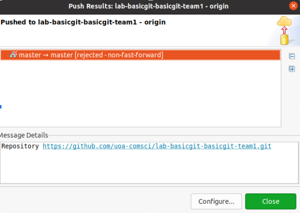
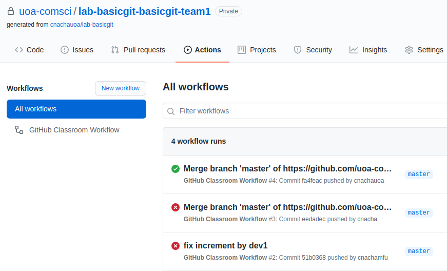

Basic Git
======================
You must perform three tasks to fix faulty in the source code and make all tests passed. After you finish each task, please commit and push your changes (you MUST write a meaningful commit message to explain the changes committed) on the master branch. Here is the steps of performing these three tasks by group of three developers: Dev1, Dev2 and Dev3.
<ol>
  <li>Dev1,2,3 - clone the project to local repository using Eclipse, 
  		<ul>
  			<li>import as a project from Git</li>
  			<li>Right click on project, Configure > Convert to Maven project</li>
  			<li>Run the project with package goal, all tests should fail</li>
  		</ul>
  <li>Dev1,2,3 - performs task 1,2 and 3 respectively on their own local source code</li>
  <li>Dev1 - stage, commit and push your changes for task 1</li>
  <li>Dev2 - perform code synchonisation as explained below and push your changes for task 2</li>
  <li>Dev3 - perform code synchonisation as explained below and push your changes for task 3</li>
</ol>

#####Task 1: Increment Fix
Fix the faulty in Counter increment(). All code changes and relevant commits must be performed on the master branch.

#####Task 2: Decrement Fix
Fix the faulty in Counter decrement(). All code changes and relevant commits must be performed on the master branch.

#####Task 3: Reset Fix
Fix the faulty in Counter reset(). All code changes and relevant commits must be performed on the master branch.

##Code Synchonisation
When dev2 and dev3 try to commit and push the source code, the push should be fail and show the error as shown in the figure below. This is because dev1 has already push the source code to Git so the source code that dev2 and dev3 are not in sync with the code on the remote repository. Github does not allow you to push the source code for this reason and therefore give the rejected message.

After you receive this rejection, you have to perform 'pull to merge' operation. This operation will combine the source code from the remote repository to your repository. Then, resolve any conflict if there is any and push the source code again. 

##Build & Run project on GitHub
To see the result of building and running test on Github, you can click on Action tab. GitHub Action is CI-CD pipeline provided by GitHub. It is similar to other CI-CD pipeline platform e.g. Travis CI, Jenkins etc. In this project, there is a workflow already defined namely Github Classroom, as shown in the figure below. This workflow is used for auto grading purpose. Every time you push the code on your repository, this workflow will be queued to execute automatically. You have to ensure that after your team made the last commit to fix all faults, the execution of this workflow runs successfully without any error (as the figure below show the success execution of last run). 

<h2>Answer the following questions</h2>
<ul>
  <li>What is different between fetch and pull?</li>
  <li>What is happen if dev2 or dev3 does not pull the code before committing and pushing to git?</li>
  <li>Can you define a new CI-CD workflow to run a specific test such as testMultiplyBy?</li>
</ul>
